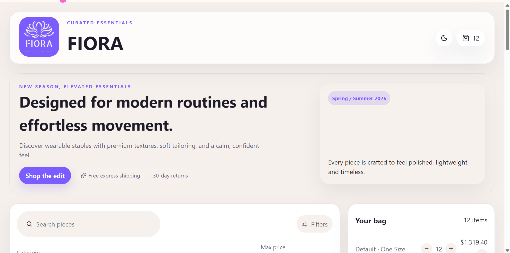

# 🛍️ FIORA - E-commerce Store

A modern and responsive e-commerce web application built with React, TypeScript, and Vite. The project allows users to browse products, search and filter items, view product details, switch between light and dark themes, and manage a shopping cart with persistent storage.

---

## 🚀 Live Demo

https://your-vercel-link.vercel.app

---

## 📸 Screenshots

### Home Page



### Product Details

(Add screenshot here)

---

## ✨ Features

- Browse products
- Search products by name
- Filter by category
- Filter by maximum price
- Product details page
- Shopping cart
- Update item quantity
- Remove items from cart
- Cart persisted with Local Storage
- Responsive design
- Light / Dark mode
- Smooth animations with Framer Motion

---

## 🛠️ Built With

- React
- TypeScript
- Vite
- React Router
- Framer Motion
- Lucide React
- CSS3

---

## 📂 Folder Structure

src/
│
├── components/
├── pages/
├── context/
├── services/
├── types/
├── utils/
├── assets/

---

## ⚙️ Installation

```bash
git clone https://github.com/nada-emad14/Fiora-Ecommerce.git

cd Fiora-Ecommerce

npm install

npm run dev
```

---

## 📌 Future Improvements

- Authentication
- Wishlist
- Checkout page
- Payment integration
- Product reviews
- Backend API

---

## 👩‍💻 Author

**Nada Emad**

LinkedIn:
https://linkedin.com/in/nada-emad-1b68b041b

GitHub:
https://github.com/nada-emad14

---

## 📄 License

This project is for educational and portfo]09p  fdxvpurposes.mh\\\\\\\\\\\\\\\\\\\\\\]]]]